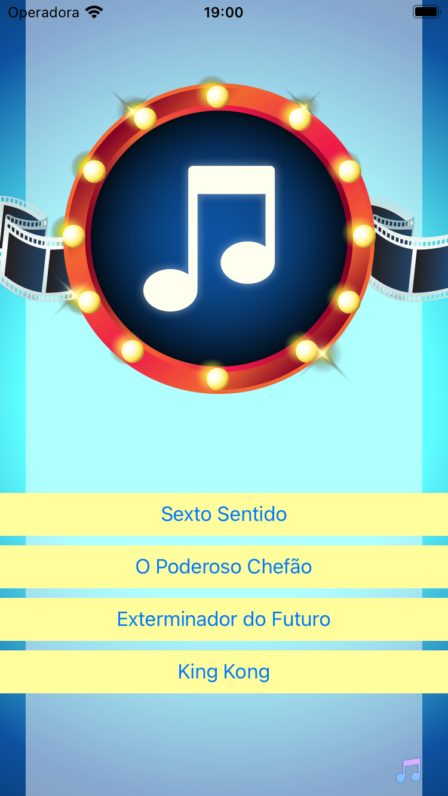
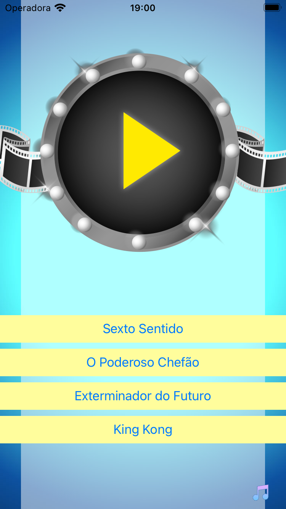
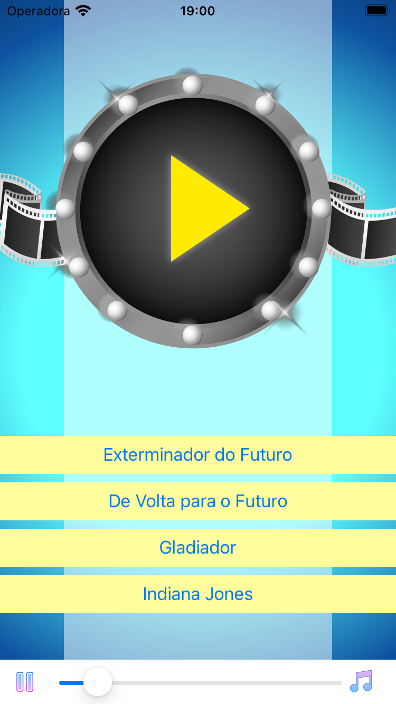
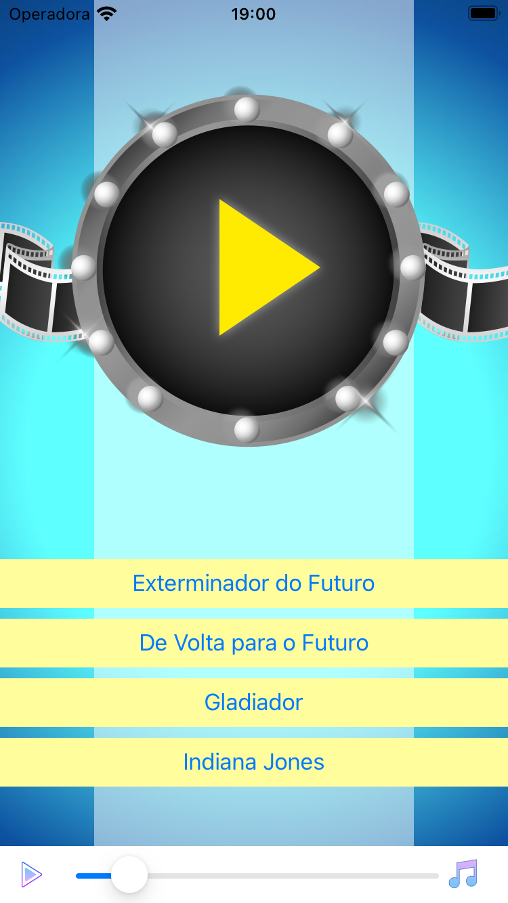

# MovieQuiz
> Aplicativo para desenvolvimento Swift/iOS

* Linguagem
    * Swift 5.5
    * MVC
    
* Auto Layout
    * Autoresizing
    * Constraint
    * Assets
    * Outlet Collection
    
* Components
    * UIView
    * UILabel
    * UIImage
    * Segue
    * UIButton
    * UISlider
    * AVAudioPlayer
        * Tratando-se de audio a Apple recomenda a utilização desta classe devida a facilidade de uso e sua versatilidade a menos que queira tocar um audio vira streaming. Essa classe é indicado para audios locais.
    * Segue
    
## Recuperação de dados JSON
    A seguir um exemplo para recuperação de dados extraído de um arquivo JSON:
    
```
class QuizManager {

    let quizes      : [Quiz]
    let quizOptions : [QuizOption]
    var round       : Round?
    var score       : Int
    
    init() {
    
    }
}
```
    
## Snapshots


  
<br/>

 
<br/> 

  
<br/>

 
<br/> 


  
<br/>
